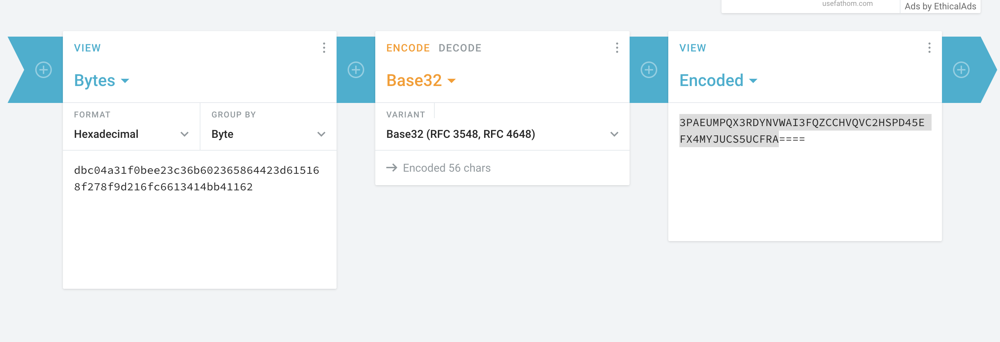

## Steps for running the Backend & Serverless together

### Run the Backend locally
In the `Backend` folder, you will find a node backend, you just enter to the folder with your console, and run

```bash
node index.js
```

Once you have it running , you need to host this backend with Ngrok , because Marlin serverless service only accepts HTTPS requests.

```
ngrok http 3000
```

This URL ngrok gives you, you need to replace in `Serverless/DigestGetter.js`
on the `baseUrl` value 

### Deploy the function
For test it on Arbitrum sepolia, go to the contract
https://sepolia.arbiscan.io/address/0x44fe06d2940b8782a0a9a9ffd09c65852c0156b1#writeContract

and there call the funcion `saveCodeInCallData`, the input is basically copy and paste the `DigestGetter.js` content.

once it is deployed, take the transaction hash
`0xdbc04a31f0bee23c36b602365864423d615168f278f9d216fc6613414bb41162`
and pass it through the page https://cryptii.com/pipes/hex-to-base32



paste it without the first 0x

copy the encoded value, and you can use it on the url

curl 3PAEUMPQX3RDYNVWAI3FQZCCHVQVC2HSPD45EFX4MYJUCS5UCFRA.oyster.run -d '{"host": "43.205.156.115"}' -v

you replace the ecoded value with your own one, and in the host, you put the ip provided by the frontend. 
This function compares the pcr2 value read from the ip page, and the one stored in the contract.

### Local test
for local test, you can run the docker image that people from Marlin has
https://github.com/marlinprotocol/oyster-serverless-devtools?tab=readme-ov-file#test-serverless-js-function-locally

after follow the steps , in a terminal tab run

```
chmod +x mock_serverless.sh
sudo ./mock_serverless.sh 8090 <path-to-js-file>
```
the js file this one refers is where you should put the minify (or not, it is not really needed) script called digestGetter.js, which will be called next

and in other terminal run

```
curl http://0:8090/ -v -d '{"host": "13.201.207.60"}'
```

you must change here the ip host for the one you need to compare.